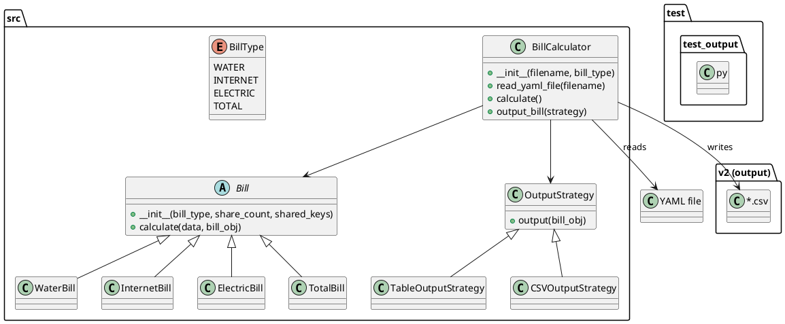

# Bill Calculator

This project is a utility for calculating and splitting monthly household bills among multiple people. It reads bill and meter reading data from YAML files, computes each person's share for electric, water, and internet bills, and outputs the results in both table and CSV formats.

## Features
- **Flexible Bill Splitting:** Supports electric, water, and internet bills, with customizable sharing rules and adjustments.
- **YAML Data Input:** Reads monthly bill and meter data from YAML files (see `src/bills.yaml`).
- **Output Strategies:** Outputs results as a pretty table in the console and as CSV files (see `v2/` directory).
- **Extensible Design:** Easily add new bill types or output strategies.
- **Automated Tests:** Includes pytest-based tests for correctness.

## Getting Started

### Prerequisites
- Python 3.x
- pip (Python package installer)

### Installation
1. Clone the repository:
    ```sh
    git clone <repository_url>
    cd <repository_directory>
    ```
2. Install the required packages:
    ```sh
    pip install -r requirements.txt
    ```

### Usage
To run the main application and calculate bills:
```sh
python main.py --file-path src/bills.yaml
```
- The results will be printed as a table and saved as a CSV file in the `v2/` directory.
- You can use other YAML files (e.g., `src/bills_2024.yaml`) as input.

### Bill Data Format
Bill data is stored in YAML files, e.g.:
```yaml
- month: 'May 2025'
  readings:
    Papa: 43446
    Jack: 50290
    Ian: 42755
    Ajin: 14460
  electric: 3901.88
  water: 1138.84
  internet: 2100
```
Each entry contains meter readings and bill amounts for a month.

### Project Structure
- `main.py` — Entry point, parses arguments and runs calculations
- `src/bill_calculator.py` — Core bill calculation logic
- `src/bill_type.py` — Bill type definitions and calculation strategies
- `src/output_strategy.py` — Output strategies (table, CSV)
- `src/bills.yaml` — Example bill data
- `test/` — Automated tests
- `v2/` — Output CSV files

### Project Structure Diagram
A high-level overview of the main classes and their relationships:



See `structure.puml` for the editable PlantUML source.

### Testing
Run all tests with:
```sh
pytest
```
- Add new test cases in the `test/` directory.
- Ensure you cover edge cases (e.g., missing readings, zero bills, new participants).
- Use diverse YAML files for robust testing (see `test/test_bills.yaml`).

### Contributing
See [CONTRIBUTING.md](CONTRIBUTING.md) for guidelines on how to contribute, add new bill types, or extend the project.

### License
MIT License

---
*Last updated: May 2025*